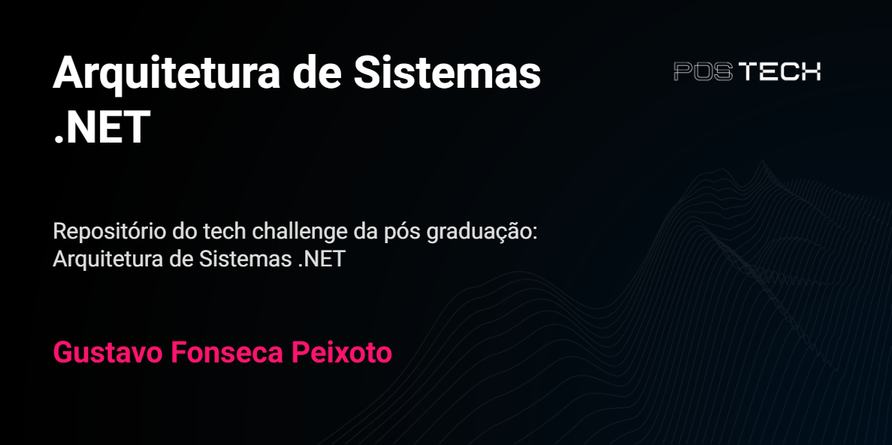
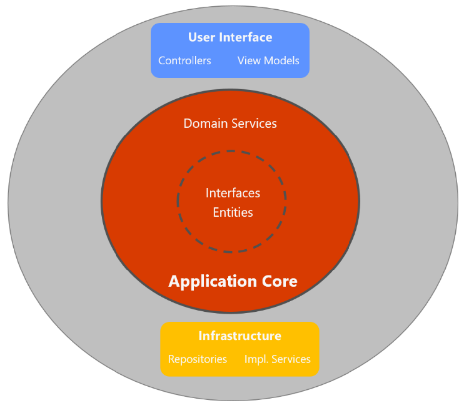

# Índice 

- [Descrição do projeto](#-descrição-do-projeto)
- [Funcionalidades do aplicativo](#-funcionalidades-do-aplicativo)
- [Técnicas e tecnologias utilizadas](#%EF%B8%8F-técnicas-e-tecnologias-utilizadas)
- [Abrir e rodar o projeto](#-abrir-e-rodar-o-projeto)

## 📚 Descrição do projeto

Projeto em Desenvolvimento para o Tech Challenge da Pós-Graduação em Arquitetura de Sistemas .NET da FIAP.
O objetivo do Tech Challenge é desenvolver um aplicativo utilizando a plataforma .NET 8 para o cadastro de contatos regionais. Este projeto considera a persistência de dados e a qualidade do software

## 🔨 Funcionalidades do aplicativo

### Cadastro de contatos
Cadastro de novos contatos, incluindo nome, sobrenome, telefone e e-mail. Cada contato é associado a um DDD correspondente à região.

### Atualização e exclusão
Atualização e a exclusão de contatos previamente cadastrados.

### Consulta de contatos
Foram implementadas duas funcionalidades para a consulta de contatos:

1 - Recuperação por Identificador Único: Permite recuperar o contato por meio do identificador único informado.

2 - Busca Avançada: Permite recuperar uma lista de contatos utilizando filtros como nome, sobrenome, DDD, e-mail ou telefone.

## ✔️ Técnicas e tecnologias utilizadas

### Arquitetura

Foi adotada a arquitetura limpa para modelar o aplicativo de contatos. Esta é uma estrutura de design de software com várias camadas, promovendo uma organização clara e fácil de compreender, o que é benéfico para o desenvolvimento.

A principal característica da arquitetura limpa é a separação e independência das camadas, desacoplando a lógica de negócios das influências externas, como a interface do usuário (UI), frameworks, bancos de dados, entre outros. Isso é alcançado ao definir uma camada de domínio independente e isolada.

Representação das camadas:

### Persistência de dados

Para persistência de dados 

## 📁 Abrir e rodar o projeto

**Apresente as instruções necessárias para abrir e executar o projeto**

