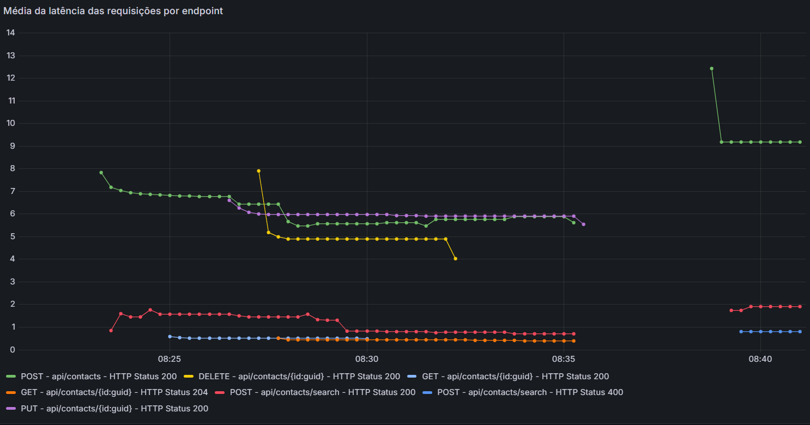
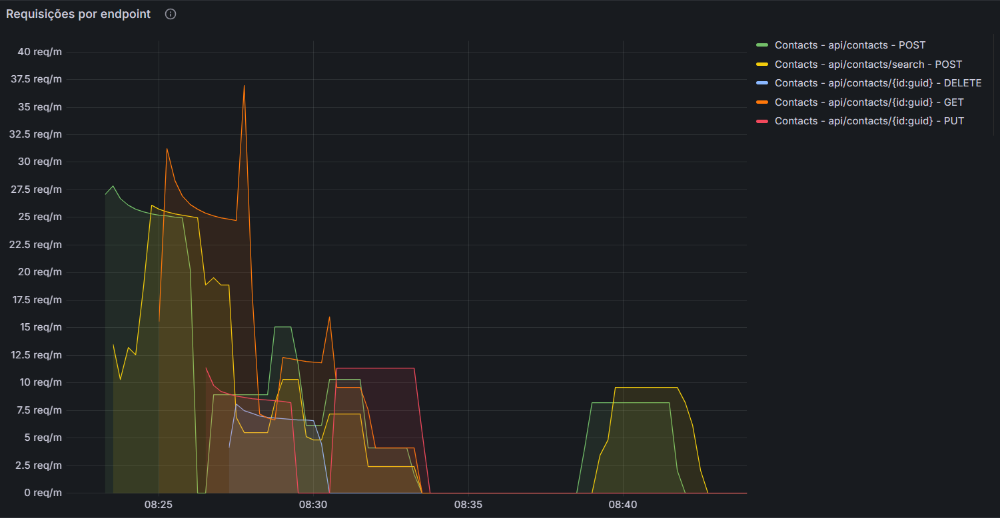
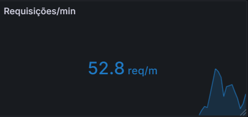
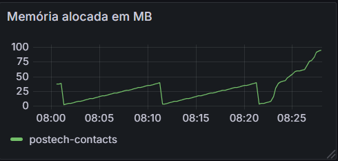
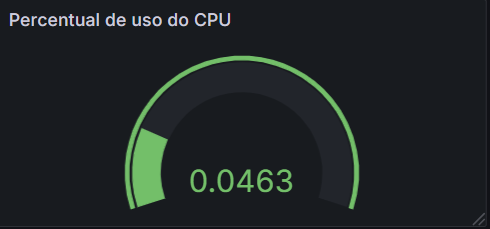
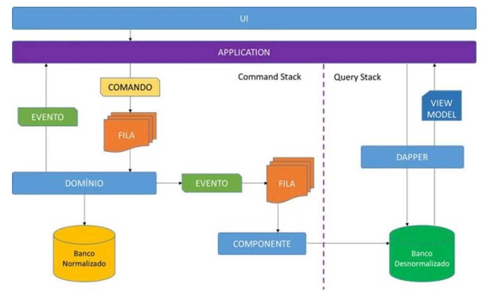
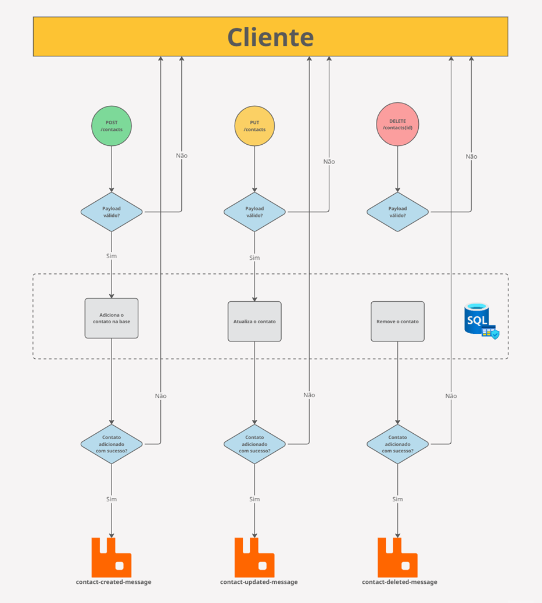
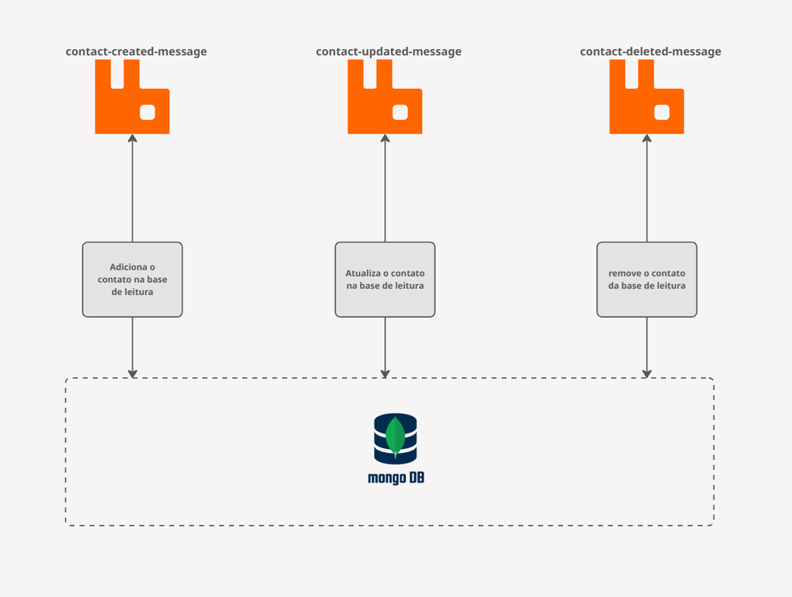
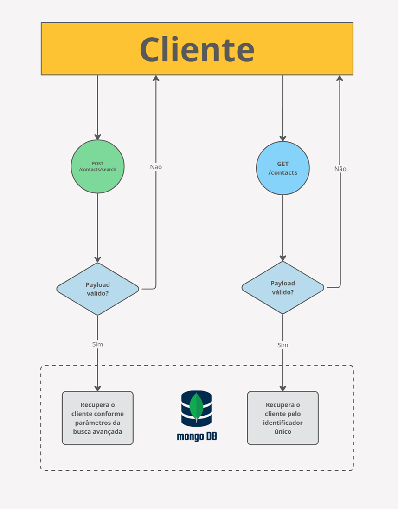
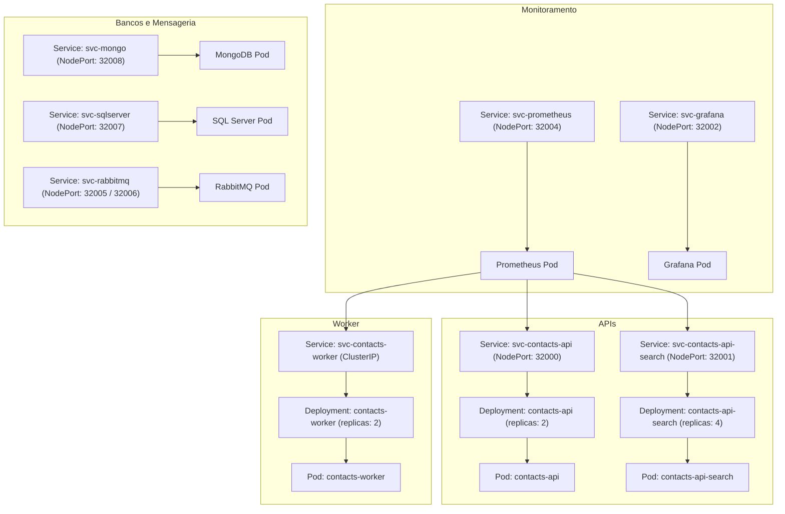

# Índice 

- [Descrição do projeto](#-descrição-do-projeto)
- [Fase 1](#fase-1)
- [Fase 2](#fase-2)
- [Fase 3](#fase-3)
- [Fase 4](#fase-4)
- [Contato](#-contato)

## 📚 Descrição do projeto

Projeto em Desenvolvimento para o Tech Challenge da Pós-Graduação em Arquitetura de Sistemas .NET da FIAP.
O objetivo do Tech Challenge é desenvolver um aplicativo utilizando a plataforma .NET 8 para o cadastro de contatos regionais. 

## Fase 1
O desafio da primeira fase consiste em desenvolver um aplicativo para cadastro de contatos regionais, com ênfase na persistência de dados, na garantia da qualidade do software e ons princípios de engenharia de software.

### 🔨 Funcionalidades do aplicativo

### Cadastro de contatos
Cadastro de novos contatos, incluindo nome, sobrenome, telefone e e-mail. Cada contato é associado a um DDD correspondente à região.

### Atualização e exclusão
Atualização e a exclusão de contatos previamente cadastrados.

### Consulta de contatos
Foram implementadas duas funcionalidades para a consulta de contatos:

1 - Recuperação por Identificador Único: Permite recuperar o contato por meio do identificador único informado.

2 - Busca Avançada: Permite recuperar uma lista de contatos utilizando filtros como nome, sobrenome, DDD, e-mail ou telefone.

### ✔️ Técnicas e tecnologias utilizadas

### Arquitetura

Foi adotada a arquitetura limpa para modelar o aplicativo de contatos. Esta é uma estrutura de design de software com várias camadas, promovendo uma organização clara e fácil de compreender, o que é benéfico para o desenvolvimento.

A principal característica da arquitetura limpa é a separação e independência das camadas, desacoplando a lógica de negócios das influências externas, como a interface do usuário (UI), frameworks, bancos de dados, entre outros. Isso é alcançado ao definir uma camada de domínio independente e isolada.

Representação das camadas:

### Persistência de dados

A persistência de dados foi realizada com o banco de dados SQL Server, utilizando o ORM Entity Framework para o mapeamento e a criação do banco (metodologia code-first).

### Validações

Para as validações, foi utilizada a biblioteca FluentValidation. Isso garante a consistência dos dados armazenados e impede a manipulação incorreta dos mesmos.

### Mediator

Para facilitar o desenvolvimento, a manutenção e manter o código limpo e legível, é importante seguir os princípios SOLID, padrões de projetos e outras boas práticas, como o desacoplamento dos objetos. Dentro deste grupo de recomendações, a adoção do Mediator Pattern tem ganhado destaque. Neste projeto o Mediator foi implementado utilizando a biblioteca MediatR.

### 📁 Abrir e rodar o projeto

### Preparando o banco de dados

Para criar o banco de dados, basta executar o script **pos-tech-contacts/scripts/1-create-data-base.sql** e para popular as tabelas Regions e Ddds o script **pos-tech-contacts/scripts/2-insert-regions=and-ddds.sql**

### Rodando a aplicação

A aplicação foi testada localmente utilizando o SDK .NET 8.0.11. Para instalar o SDK, visite esta [página](https://dotnet.microsoft.com/en-us/download/dotnet/8.0) e faça o download. 

Para executar a aplicação, utilize o comando **dotnet run** e especifique o projeto **PosTech.Contacts.Api.csproj**, conforme demonstrado a seguir:

## Fase 2

A etapa anterior do Tech Challenge focou no desenvolvimento de um aplicativo .NET para o cadastro de contatos regionais. Esse aplicativo incluía funcionalidades essenciais, como adicionar, consultar, atualizar e excluir contatos, utilizando ferramentas como Entity Framework Core para a persistência de dados, além da implementação de validações robustas. Agora, avançaremos no projeto, incorporando práticas de Integração Contínua (CI), testes de integração e monitoramento de desempenho, elevando a qualidade e a confiabilidade da aplicação a um novo patamar.

### 🖍 Teste de integração

O teste de integração tem como objetivo validar a interação entre os componentes do sistema, assegurando que consultas, comandos e operações de persistência sejam executados corretamente. Para isso, foi configurado um banco de dados real **SqlDb-PosTech-Contacts-Integration-Tests**, onde foram realizadas operações como salvar, buscar, atualizar e excluir dados, seguidas da validação dos resultados esperados. Importante destacar que o banco utilizado nos testes é isolado do ambiente de produção, garantindo a segurança e integridade dos dados.

Os testes foram realizados utilizando a biblioteca xUnit, com a configuração de um banco de dados que é criado uma única vez e reutilizado ao longo de toda a suíte de testes.

As outras abordagens possíveis seriam:

- Um por Teste: um banco de dados é criado individualmente para cada teste.
- Um por Classe de Teste: um banco de dados é configurado para cada classe de teste e compartilhado entre todos os testes dessa classe.

### 🚀 Pipeline de CI (**C**ontinuous **I**ntegration)

### 1. Build

Executado em um runner self-hosted.
- Faz o checkout do código-fonte;
- Configura o .NET SDK (versão 8.0.x);
- Restaura as dependências do projeto com o comando dotnet restore;
- Faz o build de todos os projetos no modo Debug utilizando dotnet build.

### 2. Unit Tests 

Depende da execução bem-sucedida do job anterior (build).
Executado em um runner self-hosted.
Realiza:
- Checkout do código-fonte;
- Configuração do .NET SDK;
- Build dos projetos de testes unitários;
- Execução dos testes unitários localizados em PosTech.Contacts.UnitTests com dotnet test no modo Debug, sem rebuild e com nível de detalhamento normal (verbosity normal).

### 3. Integration Tests

Também depende da execução bem-sucedida do job de build (build).
Executado em um runner self-hosted.
Realiza:
- Checkout do código-fonte.
- Configuração do .NET SDK.
- Build dos projetos de testes de integração.
- Execução dos testes de integração localizados em PosTech.Contacts.IntegrationTests com dotnet test no modo Debug, sem rebuild e com nível de detalhamento normal.

### Finalidade
Esse pipeline automatiza o processo de construção, validação e testes do código, garantindo que o build do projeto funcione corretamente e que os testes unitários e de integração sejam executados. Isso ajuda a manter a qualidade do código e facilita a detecção de erros.

### 📊 Métricas

Para monitorar a performance da aplicação de contatos, foram desenvolvidos painéis no Grafana, projetados para coletar e analisar as golden metrics. Esses indicadores oferecem informações valiosas sobre erros, latência, tráfego e saturação, permitindo identificar problemas de desempenho e manter o sistema otimizado.

As golden metrics são parâmetros essenciais para o monitoramento eficiente de sistemas. Cada uma delas desempenha um papel importante:

- Erros: Mede a taxa de falhas em requisições, como respostas HTTP 5xx, 4xx ou exceções.
- Latência: Avalia o tempo total necessário para processar uma requisição, incluindo a resposta ao cliente.
- Tráfego: Monitora o volume de solicitações ou a carga processada pelo sistema, refletindo sua utilização.
- Saturação: Indica o nível de capacidade do sistema, apontando proximidade de sobrecarga ou limites operacionais.

### Taxa de erros:

#### Painel de Erros

- Objetivo: Calcula a taxa de requisições HTTP recebidas que resultaram em códigos de status de erro (4xx ou 5xx) por minuto, agrupadas por endpoint, método HTTP e código de status.
- Resumo: Essa métrica ajuda a monitorar a quantidade de erros HTTP por minuto, facilitando a análise detalhada dos problemas por endpoint, método e código de resposta.

### Latência

#### Painel de Latência

- Objetivo: Calcula o tempo médio de duração das requisições HTTP (em milissegundos) nos últimos 5 minutos, agrupadas por instâncias e controladores específicos.
- Resumo: A métrica fornece o tempo médio de duração das requisições HTTP em milissegundos, considerando requisições dos últimos 5 minutos, filtrado por instâncias e controladores específicos.

### Tráfego

#### Painel de Requisições por Endpoint

- Objetivo: Calcula a taxa de requisições HTTP recebidas por minuto nos últimos 3 minutos, agrupando os resultados por controlador, endpoint e método HTTP.
- Resumo: A métrica monitora o volume de requisições HTTP recebidas por minuto nos últimos 3 minutos, permitindo uma análise detalhada com base no controlador, endpoint e método HTTP

#### Painel de Requisições por Minuto

- Objetivo: Calcula a taxa de requisições HTTP recebidas por minuto, somando o total de requisições capturadas nos últimos 3 minutos.
- Resumo: Essa métrica fornece o total de requisições HTTP recebidas por minuto ao longo dos últimos 3 minutos, para instâncias e controladores específicos. Isso é útil para monitorar o tráfego e identificar possíveis sobrecargas ou padrões de uso.

### Saturação

#### Painel de Uso de Memória

- Objetivo: Calcula o total de memória utilizada pelo runtime do .NET em megabytes, permitindo monitorar o consumo de memória da aplicação.
- Resumo: A métrica fornece a quantidade total de memória utilizada pelo runtime do .NET em megabytes, sendo útil para identificar problemas relacionados ao consumo de memória, como possíveis vazamentos ou uso excessivo.

#### Painel de Uso da CPU

- Objetivo: mede a utilização da CPU pelo runtime da aplicação .NET. Ela reflete a porcentagem de tempo em que o processador está ocupado executando tarefas associadas à aplicação

## Fase 3

**Evolução da API de Contatos** 🚀

Nesta fase do **Tech Challenge**, avançamos na modernização do aplicativo de **cadastro de contatos regionais**, incorporando **arquitetura de microsserviços** e **mensageria assíncrona** com **RabbitMQ**. O objetivo é refatorar a estrutura monolítica, tornando-a **mais escalável, modular e resiliente**, melhorando a comunicação entre serviços.  

### 🔹 Principais Melhorias  
1️⃣ **Arquitetura de Microsserviços + CRQS**  
   - Separação por contexto, garantindo **baixo acoplamento** e **alta coesão**.  
   - Separação da aplicação monplítica em 3 novas aplicações: microsserviço de **cadastro**, microsserviço de **busca** e microsserviço de **sincronização**, implementando uma arquitetura avançada que implementa CQRS.  

2️⃣ **Comunicação Assíncrona via RabbitMQ**  
   - Mensageria garantindo **desempenho, escalabilidade e segurança**.  
   - Implementação de um **fluxo de eventos** entre produtores e consumidores.  

### 🔄 🔹 Fluxo de Mensageria

- ✅ Após a inclusão de um contato pelo **microsserviço de cadastro**, um evento é enviado para a fila. 
- ✅ O **microsserviço de sincronização** então processa e insere os dados em uma base de leitura, 
- ✅ garantindo integridade e disponibilidade para o **microsserviço de busca**.

### ⚡Arquitetura CQRS – Command Query Responsibility Segregation

A arquitetura CQRS separa a lógica de leitura e escrita de dados, melhorando performance, escalabilidade e segurança.

- ✅ Camada de Escrita (Command) – Responsável por manipular dados, garantindo consistência e validação das operações.
- ✅ Camada de Leitura (Query) – Otimizada para consultas rápidas, podendo utilizar estruturas de dados específicas para melhor desempenho.

🔹 Essa abordagem permite que sistemas lidem eficientemente com grandes volumes de dados e múltiplos acessos concorrentes, tornando o design mais resiliente e escalável.

### Fluxo do **Microsserviço de Cadastro**

### Fluxo do **Microsserviço de Sincronização**

### Fluxo do **Microsserviço de Busca**

## Fase 4

### Objetivos
- Orquestração com Kubernetes
Implementar Kubernetes para gerenciar deploys, escalabilidade e estado dos microsserviços.
- Escalabilidade e Resiliência
Usar ReplicaSets, Deployments e Services para garantir que cada serviço seja dimensionado e tolerante a falhas.
- Gerenciamento de Configuração e Dados
Utilizar ConfigMaps e Volumes para externalizar configurações e manter dados persistentes de cada microsserviço.

### 📚 Arquitetura Proposta

## 📚 Contato

Gustavo Peixoto
gustavo.fonseca.peixoto@gmail.com
